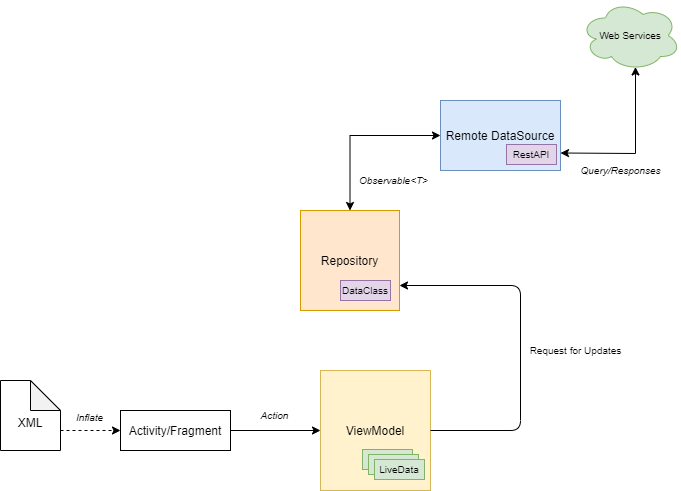

# News-App

Purpose: showcase app development skills with the uses of current Architecture, Android frameworks combining with usages of popular 3rd libraries. 

# App Architecture Diagram - MVVM

# Tech-Stack 
**> Architecture:** MVVM  
**> Dependency Injection:** Koin  
**> Json Parser:** Moshi  
**> Image Loading:** Picasso  
**> Networking Services:** Retrofit2  
**> Programming Language:** Kotlin  
**> Coroutines:** light-weight threads that can be use for network operations 
**> LiveData:** convert data into observable that can observe by other components 
